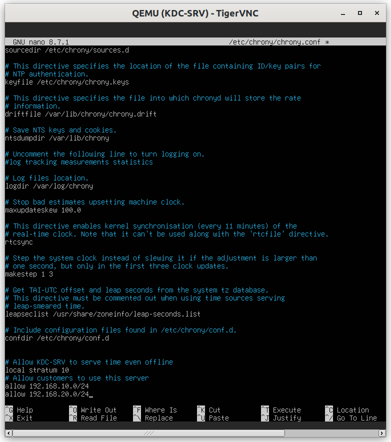
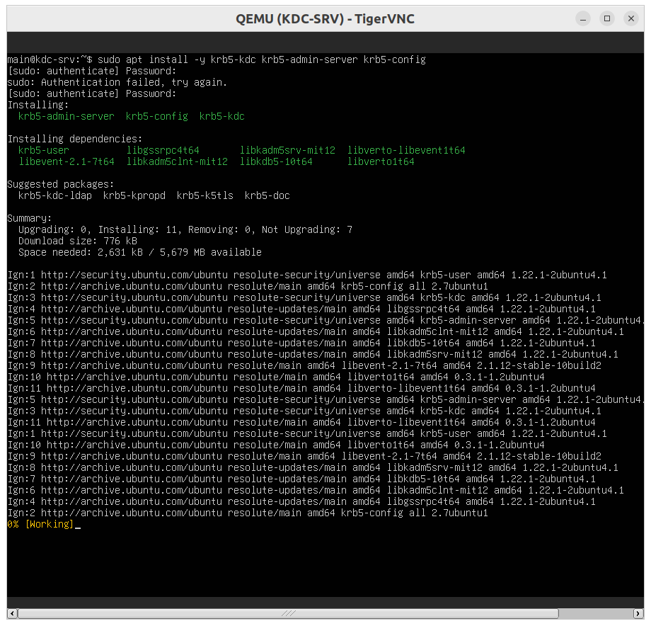
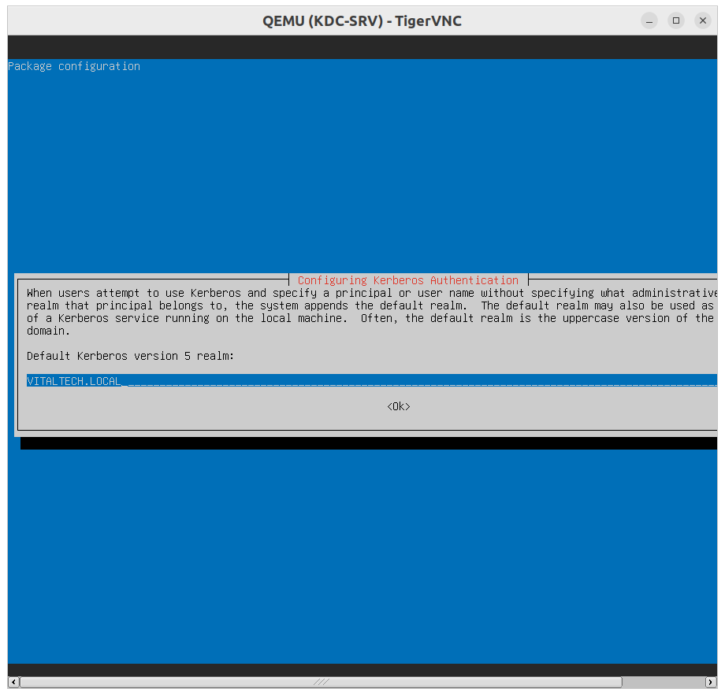

# KDC-SRV Configuration (MIT Kerberos)

## Summary table of steps

| # | Step | Key command / action | Purpose |
|---|---|---|---|
| 1 | Time synchronization | `chronyc tracking` | Critical prerequisite for Kerberos |
| 2 | Install KDC packages | `apt install krb5-kdc krb5-admin-server` | Set up the KDC service |
| 3 | Create the realm | `krb5_newrealm` | Initialize the VITALTECH.LOCAL Kerberos database |
| 4 | Configure admin ACL | Edit `kadm5.acl` | Authorize realm administration |
| 5 | Start services | `systemctl enable --now krb5-kdc krb5-admin-server` | Enable the KDC permanently |
| 6 | Create user principals | `kadmin.local -q "addprinc ..."` | One Kerberos identity per department |
| 7 | Create the NFS service principal | `addprinc -randkey nfs/nfs-srv.vitaltech.local` | Identity of the NFS server |
| 8 | Generate and export the keytab | `ktadd -k nfs.keytab ...` | Secret file transferred to NFS-SRV |
| 9 | Final check | `listprincs` | Confirm all principals exist |

---

## Step 1 — Time synchronization



Kerberos computes ticket validity in UTC with a strict 5-minute tolerance. KDC-SRV was configured as the
time reference (`local stratum 10`) so the lab stays synchronized even offline.

## Step 2 — Install KDC packages



```bash
sudo apt install krb5-kdc krb5-admin-server krb5-config -y
```

During installation, the default realm entered is `VITALTECH.LOCAL`, with both the KDC and admin server
pointing to `kdc-srv.vitaltech.local`.

## Step 3 — Create the realm



```bash
sudo krb5_newrealm
```

This command initializes the Kerberos database and prompts for a master password, used to locally
encrypt the principal database.

## Step 4 — Configure the admin ACL


Authorizes any principal of the form `xxx/admin` to fully administer the realm via `kadmin`.

## Step 5 — Start the services


```bash
sudo systemctl enable --now krb5-kdc krb5-admin-server
```

## Step 6 — Create user principals (one per department)


```bash
sudo kadmin.local -q "addprinc user_rh"
sudo kadmin.local -q "addprinc user_it"
sudo kadmin.local -q "addprinc user_direction"
sudo kadmin.local -q "addprinc user_general"
sudo kadmin.local -q "addprinc user_dev"
```

Each principal has its own password, independent of any local Unix account — Kerberos only knows this
identity, not the system accounts.

## Step 7 — Create the NFS service principal


```bash
sudo kadmin.local -q "addprinc -randkey nfs/nfs-srv.vitaltech.local"
```

`-randkey` generates a random key instead of an interactive password — this principal is never used for
a human login, only for the NFS service's own authentication.

## Step 8 — Generate and transfer the keytab


```bash
sudo kadmin.local -q "ktadd -k /tmp/nfs.keytab nfs/nfs-srv.vitaltech.local"
scp /tmp/nfs.keytab user@nfs-srv:/tmp/
```

The file contains the NFS service's secret key — it is transferred once, then removed from KDC-SRV to
avoid leaving a residual copy.

## Step 9 — Final check


```bash
sudo kadmin.local -q "listprincs"
```

Confirms the presence of the 5 user principals plus the NFS service principal.