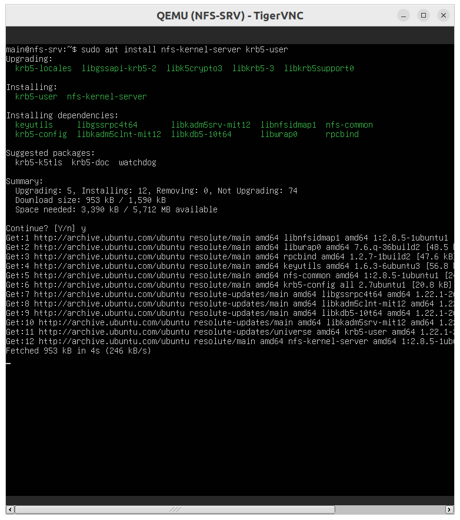
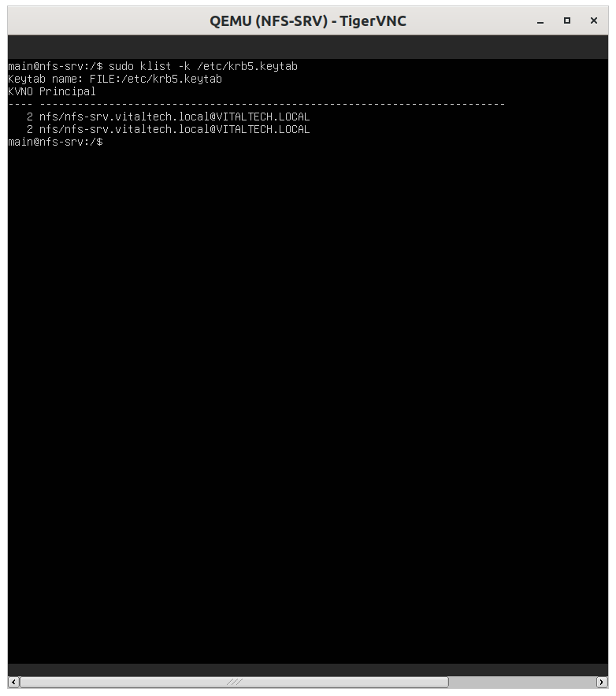
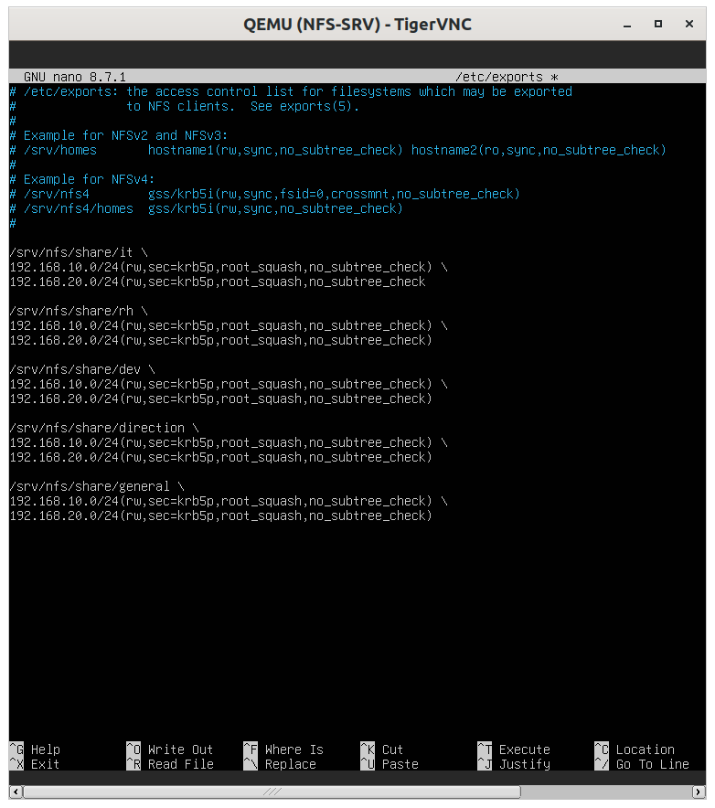

# NFS-SRV Configuration (NFSv4 + Kerberos)

## Summary table of steps

| # | Step | Key command / action | Purpose |
|---|---|---|---|
| 1 | Install packages | `apt install nfs-kernel-server krb5-user nfs-common` | NFS server + Kerberos support |
| 2 | Install the keytab | `mv nfs.keytab /etc/krb5.keytab` | Authenticate the NFS service |
| 3 | Create groups | `groupadd rh/it/dev/...` | One group per department |
| 4 | Create users | `useradd -m -G <group> user_xxx` | Unix accounts mirroring the principals |
| 5 | Create exported folders | `mkdir /srv/nfs/share/<dept>` | Share structure |
| 6 | Permissions and ownership | `chown root:<group>` + `chmod 770` | Per-department isolation |
| 7 | Configure exports | Edit `/etc/exports` (`sec=krb5p`) | Secure export |
| 8 | Apply exports | `exportfs -ra` | Activate the configuration |
| 9 | Configure idmapd | `Domain = vitaltech.local` | Map Kerberos identity ↔ Unix UID |
| 10 | Check NFSv4 ACLs | `nfs4_getfacl <folder>` | Rule out conflicts with Unix permissions |
| 11 | Final check | `showmount -e localhost` | Confirm active exports |

---

## Step 1 — Install packages



```bash
sudo apt install nfs-kernel-server krb5-user nfs-common -y
```

`krb5-user` lets the server talk to the KDC; `nfs-kernel-server` provides the export service.

## Step 2 — Install the keytab



```bash
sudo mv /tmp/nfs.keytab /etc/krb5.keytab
sudo chown root:root /etc/krb5.keytab
sudo chmod 600 /etc/krb5.keytab
klist -k /etc/krb5.keytab
```

The file must be strictly protected (600, root only) — it is the secret that lets the server prove its
`nfs/nfs-srv.vitaltech.local` identity to clients.

## Step 3 — Create department groups

```bash
sudo groupadd rh
sudo groupadd it
sudo groupadd direction
sudo groupadd general
sudo groupadd dev
```

## Step 4 — Create Unix users (mirroring the Kerberos principals)

```bash
sudo useradd -m -G rh user_rh
sudo useradd -m -G it user_it
sudo useradd -m -G direction user_direction
sudo useradd -m -G general user_general
sudo useradd -m -G dev user_dev
```

The Unix account name must match the Kerberos principal name (without `@VITALTECH.LOCAL`) for identity
mapping to work correctly.

## Step 5 — Create exported folders

```bash
sudo mkdir -p /srv/nfs/share/{rh,it,direction,general,dev}
```

## Step 6 — Permissions and ownership


```bash
sudo chown root:rh /srv/nfs/share/rh
sudo chown root:it /srv/nfs/share/it
sudo chown root:direction /srv/nfs/share/direction
sudo chown root:general /srv/nfs/share/general
sudo chown root:dev /srv/nfs/share/dev

sudo chmod 770 /srv/nfs/share/{rh,it,direction,general,dev}
```

## Step 7 — Configure exports (sec=krb5p)



`sec=krb5p` enforces both authentication and encryption of traffic; `root_squash` prevents a remote root
from acting as local root; both VLANs (10 and 20) are allowed since servers and clients are separated.

## Step 8 — Apply the exports


```bash
sudo exportfs -ra
sudo exportfs -v
```

## Step 9 — Configure idmapd


```ini
[General]
Domain = vitaltech.local
```

```bash
sudo nfsidmap -c
```

This file must be strictly identical on the server AND all clients — otherwise Kerberos identities don't
map correctly to Unix UID/GID (typical symptom: files owned by `nobody:nogroup`).

## Step 10 — Check NFSv4 ACLs

📸 *[Screenshot: `nfs4_getfacl`]*

```bash
nfs4_getfacl /srv/nfs/share/it
```

An existing NFSv4 ACL takes precedence over classic Unix permissions (`chmod`). If write access is
blocked despite correct Unix permissions, check for and clean up any leftover ACL:

```bash
sudo nfs4_setfacl -s "A::OWNER@:rwaDxtcy,A::GROUP@:rwaDxtcy" /srv/nfs/share/it
```

## Step 11 — Final check


```bash
showmount -e localhost
```

Confirms that all 5 exports are active and visible.