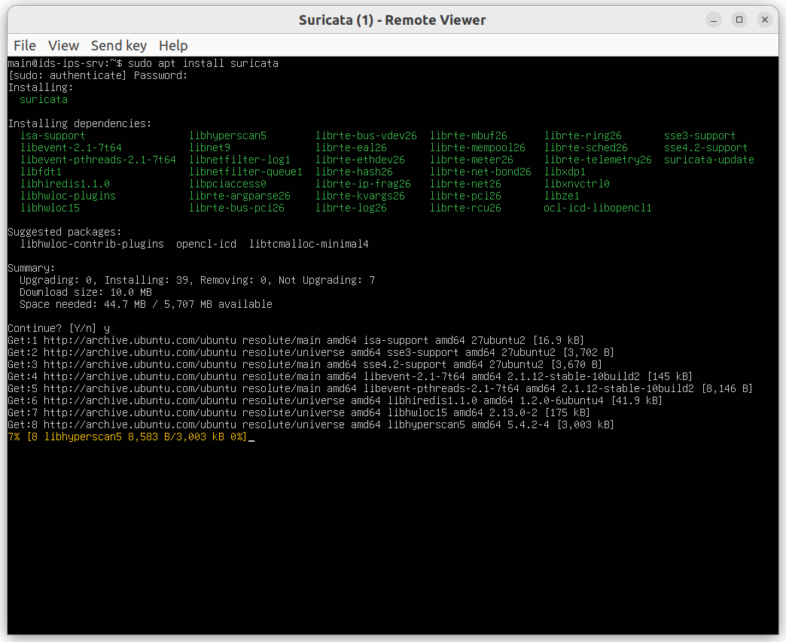
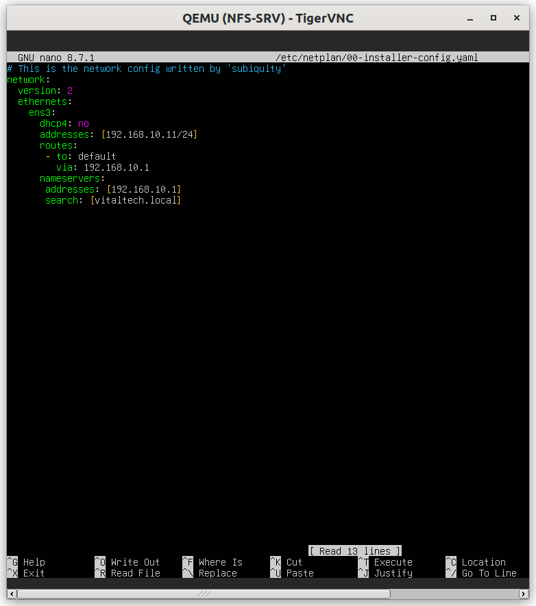
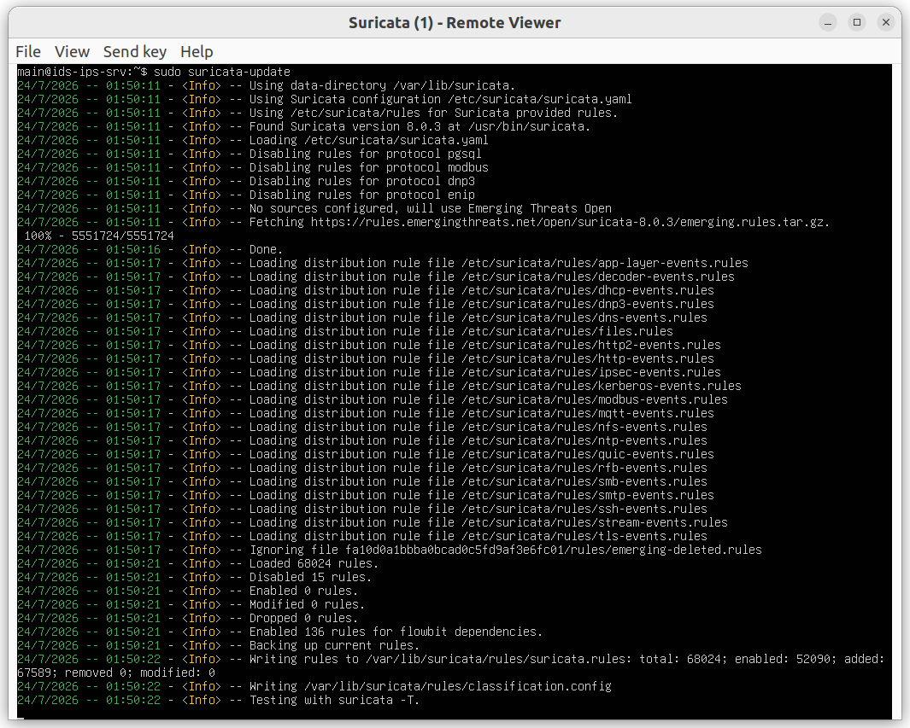
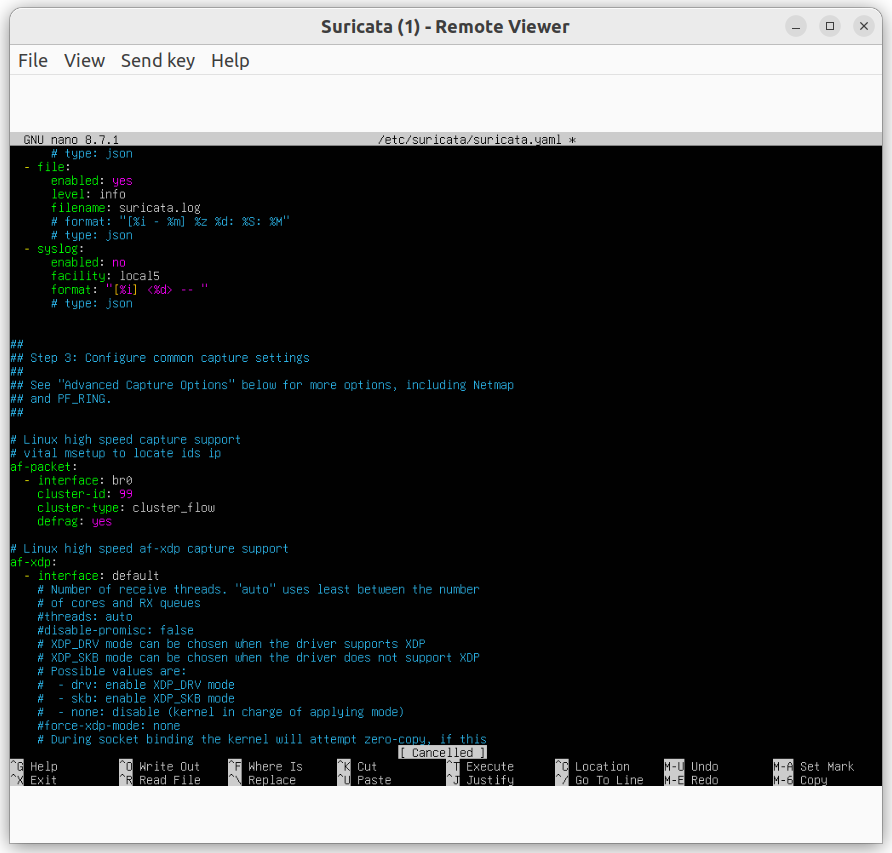

# Suricata Configuration (Inline IDS/IPS)

## Summary table of steps

| # | Step | Key command / action | Purpose |
|---|---|---|---|
| 1 | Install Suricata | `apt install suricata` | Set up the IDS/IPS engine |
| 2 | Set ip Static | `sudo nano /etc/netplan/*yaml` | To configure IP static |
| 3 | Update Emerging Threats rules | `suricata-update` | Load a detection rule set |
| 4 | Configure IDS mode (passive listening) | Edit `suricata.yaml` (af-packet) | Detection without blocking |
| 5 | Test IDS mode | Generate traffic + read `eve.json` | Validate alert detection |
| 6 | Switch to IPS mode (inline) | Configure `af-packet` in `ips` mode, bridge the 2 interfaces | Move from detection to blocking |
| 7 | Test IPS mode | Attempt malicious traffic | Validate actual blocking (inconclusive, needs further work) |

---

## Step 1 — Install Suricata



```bash
sudo apt install suricata -y
```

## Step 2 — Check network interfaces (inline tap)



```bash
ip a
```

**Issue encountered**: after a reboot, the interfaces changed names (`ens4/ens5` → `ens3/ens4`),
requiring the `af-packet` configuration to be adjusted each time.

## Step 3 — Update Emerging Threats rules



```bash
sudo suricata-update
sudo suricata-update list-sources
```

Loads a set of community detection rules (scans, suspicious behavior, known signatures).

## Step 4 — Configure IDS mode (passive listening)



```yaml
af-packet:
  - interface: ens3
    cluster-id: 99
    cluster-type: cluster_flow
    defrag: yes
```

In pure IDS mode, Suricata passively listens to traffic without affecting its routing — useful to
validate detection before risking blocking legitimate traffic.

## Step 5 — Test IDS mode


```bash
sudo tail -f /var/log/suricata/eve.json | grep alert
```

Generate traffic recognized by the ET rules (e.g., a port scan from Atk-1), then confirm the appearance
of matching alerts in the logs — **successfully validated** in this lab.

## Step 6 — Switch to IPS mode (inline)


```yaml
af-packet:
  - interface: ens3
    copy-mode: ips
    copy-iface: ens4
  - interface: ens4
    copy-mode: ips
    copy-iface: ens3
```

## Step 7 — Test IPS mode


```bash
sudo systemctl restart suricata
sudo tail -f /var/log/suricata/eve.json | grep drop
```

**Status**: the IPS switch is technically in place, but real blocking tests with the generic ET rules
were inconclusive — no calibrated `drop` rule was validated. Left as a follow-up item for the dedicated
Suricata lab.