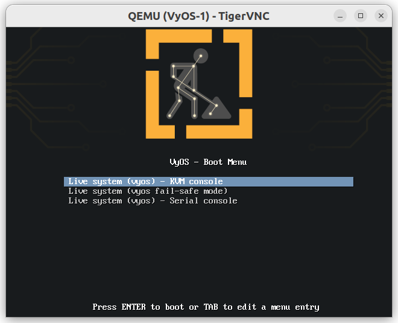
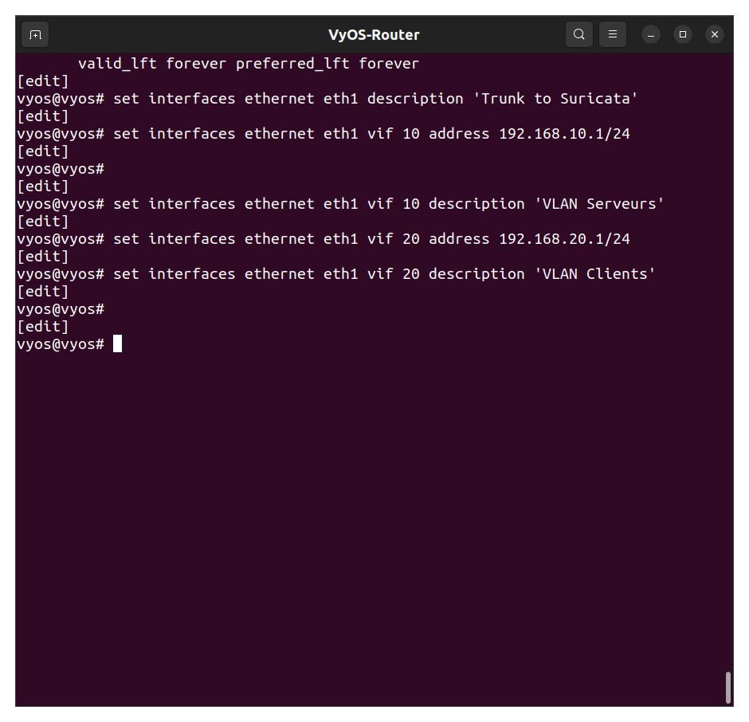
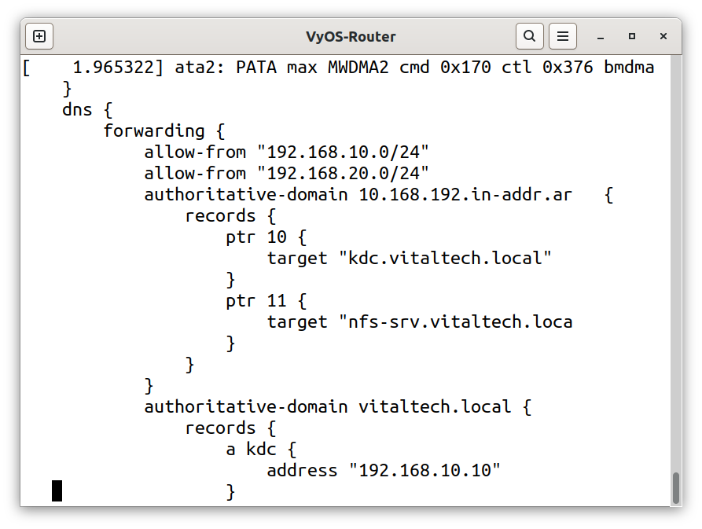

# VyOS-Router Configuration (Inter-VLAN Routing, DHCP, DNS, NAT)

## Summary table of steps

| # | Step | Key command / action | Purpose |
|---|---|---|---|
| 1 | Configure VLAN interfaces | `set interfaces ethernet ethX vif <id> address ...` | Router-on-a-stick on the trunk |
| 2 | Configure DHCP | `set service dhcp-server shared-network-name ...` | Automatic IP assignment per VLAN |
| 3 | Configure DNS forwarding | `set service dns forwarding` | Resolve `vitaltech.local` + external names |
| 4 | Configure DNS zones (forward/reverse) | `set service dns forwarding domain vitaltech.local` | Internal FQDN resolution |
| 5 | Configure NAT | `set nat source rule ... masquerade` | Internet access for the VMs |
| 6 | Verify inter-VLAN routing | `show ip route` | Confirm VLAN10 ↔ VLAN20 connectivity |
| 7 | Save the configuration | `commit` then `save` | Persist across reboots |

---



## Step 1 — Configure VLAN interfaces (router-on-a-stick)



set interfaces ethernet eth0 vif 10 address '192.168.10.1/24'
set interfaces ethernet eth0 vif 20 address '192.168.20.1/24'

VyOS receives the trunk on a single physical interface, and separates traffic per VLAN via `vif`
sub-interfaces. **Issue encountered**: after a reboot, GNS3/the system sometimes renamed the physical
interface (`eth0` → `eth2`), breaking the config — always check `show interfaces` after a restart and
adjust if needed.

## Step 2 — Configure DHCP per VLAN


set service dhcp-server shared-network-name LAN_SRV subnet 192.168.10.0/24 range 0 start '192.168.10.100'
set service dhcp-server shared-network-name LAN_SRV subnet 192.168.10.0/24 range 0 stop '192.168.10.200'
set service dhcp-server shared-network-name LAN_CLIENTS subnet 192.168.20.0/24 range 0 start '192.168.20.100'
set service dhcp-server shared-network-name LAN_CLIENTS subnet 192.168.20.0/24 range 0 stop '192.168.20.200'

Each VLAN has its own DHCP range, consistent with the server (VLAN10) / client (VLAN20) separation.

## Step 3 — Configure DNS forwarding



set service dns forwarding listen-address 192.168.10.1
set service dns forwarding listen-address 192.168.20.1
set service dns forwarding name-server 8.8.8.8

Allows VMs to resolve both internal names (`vitaltech.local`) and external names (needed in particular
for `apt` package installation).

## Step 4 — Internal domain resolution (forward + reverse)

set service dns forwarding domain vitaltech.local

Essential for Kerberos: `kinit` and NFS mounts rely on correctly resolving FQDNs
(`nfs-srv.vitaltech.local`, `kdc-srv.vitaltech.local`), not just IPs.

## Step 5 — Configure NAT (internet access)


set nat source rule 100 outbound-interface 'eth1'
set nat source rule 100 source address '192.168.0.0/16'
set nat source rule 100 translation address masquerade

Needed so VMs can reach the internet (`apt` updates, external NTP synchronization where applicable).

## Step 6 — Verify inter-VLAN routing


```bash
ping -c 3 192.168.20.102
```

Confirms VyOS correctly routes traffic between servers and clients — a prerequisite for Kerberos and NFS
to work across both VLANs.

## Step 7 — Save the configuration


**Important**: without `save`, the configuration is lost on reboot — several lab incidents involving
renamed interfaces required re-checking this step after every reboot.
