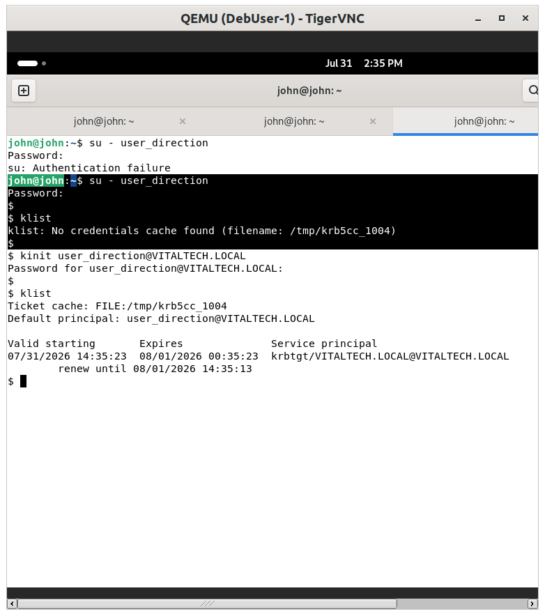
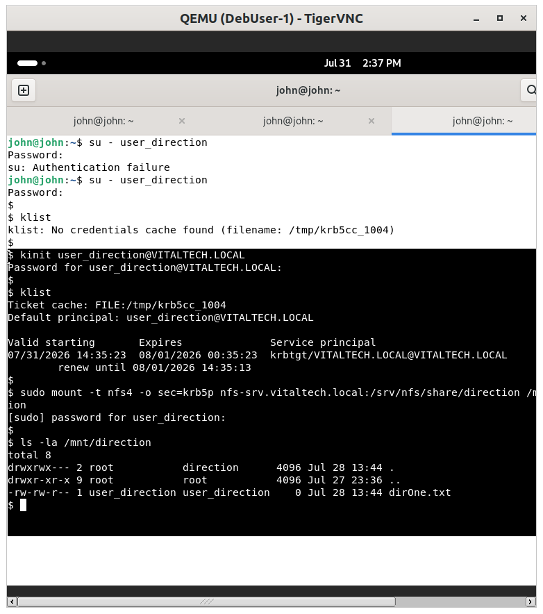
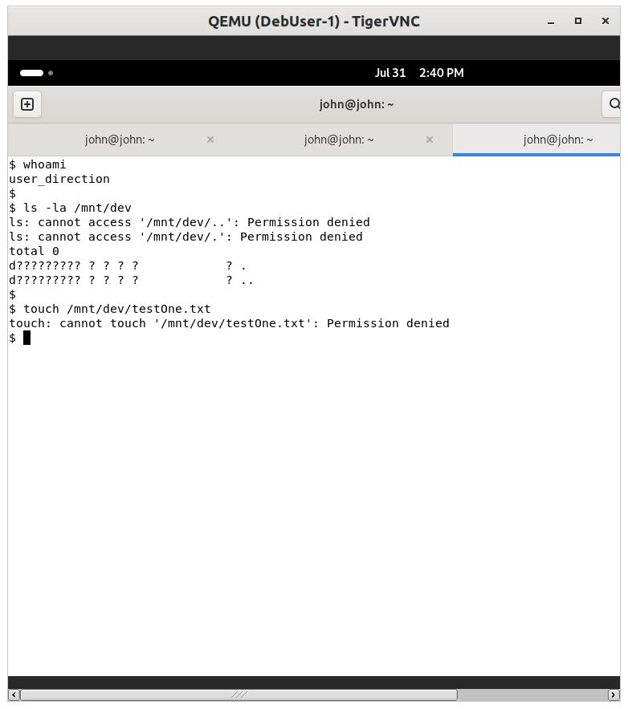

# Security Tests — Proving NFS + Kerberos Enforcement

This section documents live tests proving that the NFS export, secured with `sec=krb5p`, correctly
enforces both authentication and department-level access control.

## Summary table of tests

| # | Test | Target | Expected result (proof) |
|---|---|---|---|
| 1 | Legitimate access without Kerberos ticket | `user_rh` without `kinit` | Access denied |
| 2 | Legitimate access with valid Kerberos ticket | `user_rh` after `kinit` | Access granted, read/write works |
| 3 | UID/GID spoofing attempt (no Kerberos ticket) | Fake local user, same UID as `user_rh` | Mount denied by server |
| 4 | Cross-department access attempt | `user_rh` accessing the `dev` export | Access denied despite valid ticket |
| 5 | Comparison: same spoofing attempt against a `sec=sys` export | Fake local user vs `sec=sys` export | Access granted (no check at all) |

---

## Step 1 — Legitimate access without a Kerberos ticket



```bash
su - user_direction
klist
ls -la /mnt/direction
```

Expected: `klist` shows no ticket cache, and the `ls` fails with `Permission denied` — proving that having
a legitimate Unix account is not enough; Kerberos authentication is actually required at access time.

## Step 2 — Legitimate access with a valid ticket



```bash
kinit user_rh@VITALTECH.LOCAL
klist
touch /mnt/rh/proof_kerberos.txt
ls -la /mnt/direction
```

Expected: the ticket is issued, and the write succeeds — confirming the export works correctly for
properly authenticated users.

## Step 3 — UID/GID spoofing attempt against the `sec=krb5p` export


```bash
sudo useradd -u 1001 -o fake_dev
su fake_dev
sudo mount -t nfs4 -o sec=krb5p nfs-srv.vitaltech.local:/srv/nfs/share/rh /mnt/dev
```

Expected: `mount.nfs4: access denied by server` — the mount itself fails before any UID comparison can
happen, since no Kerberos context was established.

## Step 4 — Cross-department access attempt (authorization check)



```bash
kinit user_rh@VITALTECH.LOCAL
ls -la /mnt/dev
touch /mnt/dev/test.txt
```

Expected: access denied — Kerberos correctly authenticates `user_rh`, but Unix group permissions
(`user_rh` is not in the `dev` group) still enforce department-level isolation. This confirms Kerberos and
Unix permissions work together, not as substitutes for one another.

## Step 5 — Same spoofing attempt against a `sec=sys` export (control comparison)


```bash
sudo mount -t nfs4 -o sec=sys nfs-srv.vitaltech.local:/srv/nfs/share/it /mnt/it
cat /mnt/it/confidential.txt
```

Expected: access is granted immediately, with no authentication check — this is the direct control case
showing what `sec=krb5p` prevents in Step 3.

---

## Key takeaway

Kerberos-secured NFS (`sec=krb5p`) correctly blocks unauthenticated access and UID spoofing, while Unix
group permissions continue to enforce department-level isolation on top of Kerberos authentication. The
comparison against the equivalent `sec=sys` export confirms this protection is specifically due to
Kerberos, not incidental configuration.